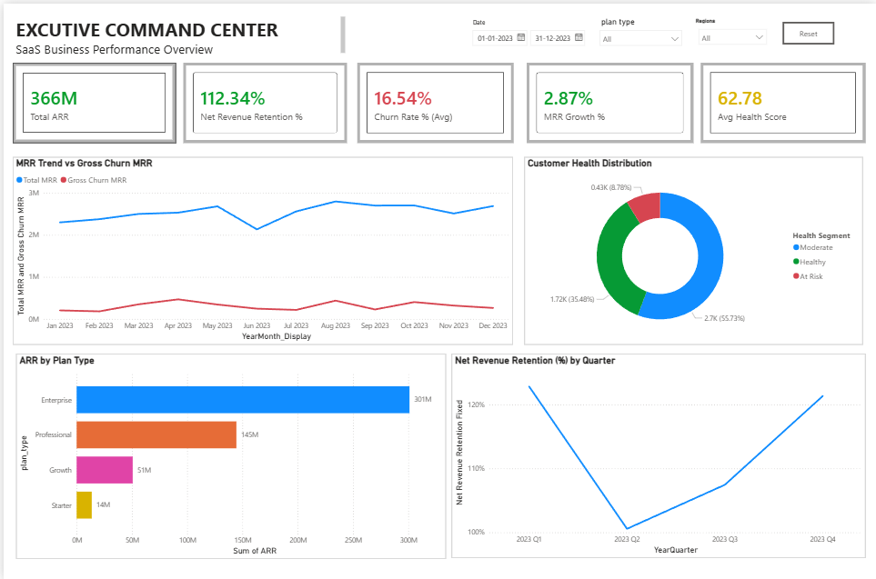
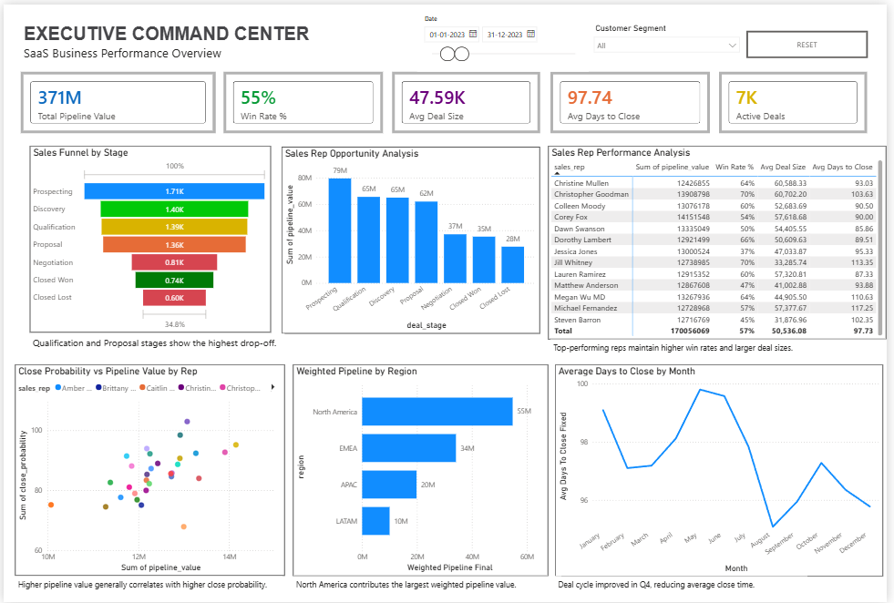
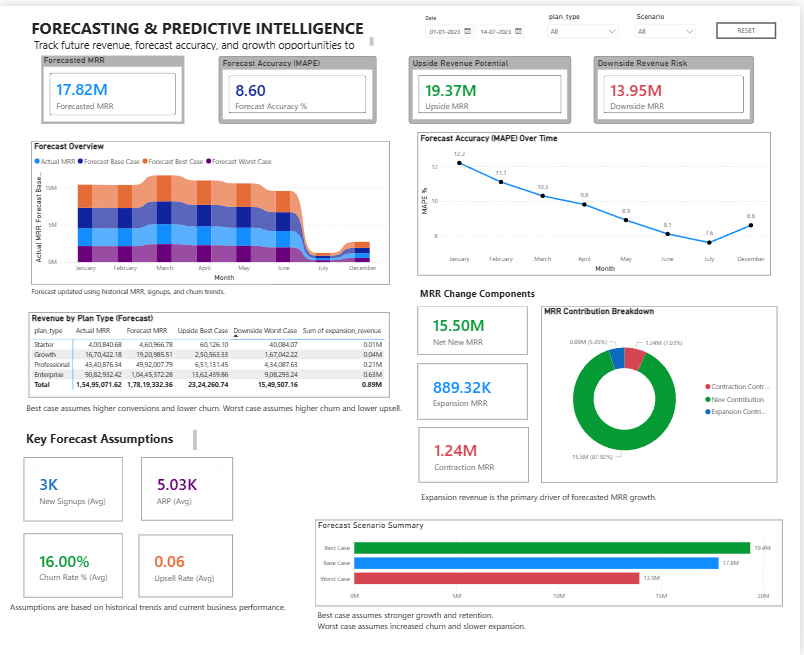

<div align="center">

# Shaheer Analytics

### Enterprise Analytics | RevOps Intelligence | Forecasting | Business Intelligence

Enterprise analytics portfolio focused on executive decision-making, revenue operations intelligence, customer analytics, forecasting, and business performance optimization using SQL, Python, and Power BI.

---


</div>

---

# About This Portfolio

This repository contains enterprise-grade analytics projects designed around real-world business problems across:

- Revenue Operations
- Executive Intelligence
- Customer Analytics
- Forecasting
- Sales Intelligence
- Marketing Attribution
- Operational Analytics
- Predictive Modeling

The focus of this portfolio is not only dashboard creation, but building complete business intelligence systems capable of supporting executive and operational decision-making.

---

# Featured Enterprise Projects

| Project | Description | Tech Stack |
|---|---|---|
| **Veltrix RevOps Intelligence** | Enterprise revenue operations intelligence system for executive KPI monitoring, forecasting, churn analysis, and operational visibility | SQL, Python, Power BI |
| **SaaS User Retention Analytics** | Product analytics platform focused on cohort analysis, activation funnels, and retention intelligence | SQL, Python |
| **Marketing Attribution Intelligence** | Multi-channel campaign performance and CAC/LTV analytics system | SQL, Power BI |
| **Customer Churn Prediction Engine** | Machine learning pipeline for churn prediction and customer risk scoring | Python, scikit-learn |

# Featured Project

## Vertix RevOps Intelligence

Enterprise-grade Revenue Operations and Business Intelligence platform built using SQL, Power BI, Python, and Predictive Analytics.

### Project Highlights

- Executive KPI Monitoring
- Revenue Performance Analysis
- Customer Segmentation
- Forecasting & Predictive Intelligence
- Operational Analytics

### Dashboard Pages

#### Page 1 – Executive Summary



#### Page 2 – Revenue Analysis



#### Page 3 – Customer Segmentation


#### Page 4 – Forecasting & Predictive Intelligence


---

# Core Capabilities

## Business Intelligence
- Executive KPI systems
- Revenue intelligence
- Operational reporting
- Forecasting workflows
- Strategic analytics

## Data Analytics
- SQL transformations
- Exploratory data analysis
- Cohort analysis
- Funnel analytics
- Customer segmentation

## Predictive Analytics
- Revenue forecasting
- Churn prediction
- Customer risk scoring
- Trend modeling

## Visualization & Reporting
- Power BI dashboards
- DAX modeling
- Executive storytelling
- Interactive reporting systems

---

# Repository Architecture

```text
shaheer-analytics
│
├── 01-veltrix-revops-intelligence
├── 02-product-retention-analytics
├── 03-marketing-attribution-intelligence
├── 04-churn-prediction-engine
│
└── supporting-assets
