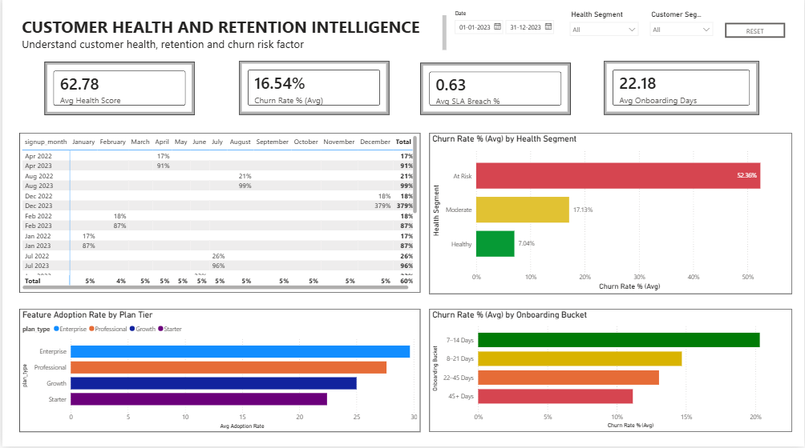

<h1 align="center">Shaheer Analytics</h1>
<h3 align="center">Enterprise Analytics | RevOps Intelligence | 
Business Intelligence</h3>

  
  
  
  

---

## About This Portfolio

Enterprise analytics portfolio built around real-world B2B SaaS 
business problems — combining domain expertise from 4+ years in 
Sales and Customer Success with technical skills in SQL, Python, 
and Power BI.

---

## Flagship Project — Veltrix AI RevOps Intelligence Platform

The most comprehensive project in this portfolio. A complete 
4-page Revenue Operations Intelligence Platform built for a 
fictional B2B SaaS company.

### What Was Built
- 6 synthetic datasets with embedded business logic (50,000+ rows)
- Complete star schema data model
- 40+ DAX measures library
- 4-page Power BI dashboard covering the full GTM analytics stack

### Dashboard Pages

**Page 1 — Executive Command Center**

**Page 2 — Revenue Operations Intelligence**

**Page 3 — Customer Health & Retention Intelligence**

**Page 4 — Forecasting & Predictive Intelligence**

### Key Business Insights Uncovered
- At Risk customers churn at **52.36%** vs 7.04% for Healthy segment
- SLA breach rate correlates with churn at **r = 0.68**
- Customers onboarded in 7–14 days show **highest churn** — 
  quality of onboarding matters more than speed
- Enterprise plan drives **82% of total ARR** (301M of 366M)
- NRR of **112.34%** confirms healthy expansion motion

### Tech Stack
| Layer | Tools |
|---|---|
| Dashboard | Power BI Desktop, DAX, Data Modeling |
| Data | Python (pandas, numpy), 6 CSV datasets |
| SQL | Schema design, staging, business analysis queries |
| Architecture | Star schema, fact/dimension tables, RLS |

**[→ Explore Full Project](https://github.com/shaheero699-lang/shaheer-analytics/tree/main/01-veltrix-revops-intelligence)**

---

## Skills & Tools

| Category | Tools |
|---|---|
| Business Intelligence | Power BI, DAX, Star Schema, Data Modeling |
| SQL | Query writing, CTEs, window functions, schema design |
| Python | pandas, numpy, matplotlib, seaborn, scikit-learn |
| Domain Knowledge | RevOps, SaaS Metrics, Churn Analysis, Cohort Analysis, GTM |

---

## Contact

📩 Open to Data Analyst & RevOps Analyst roles   
🔗 [LinkedIn](https://www.linkedin.com/in/shaheer-mohamed-769b61312/)  
📍 Bengaluru, India
